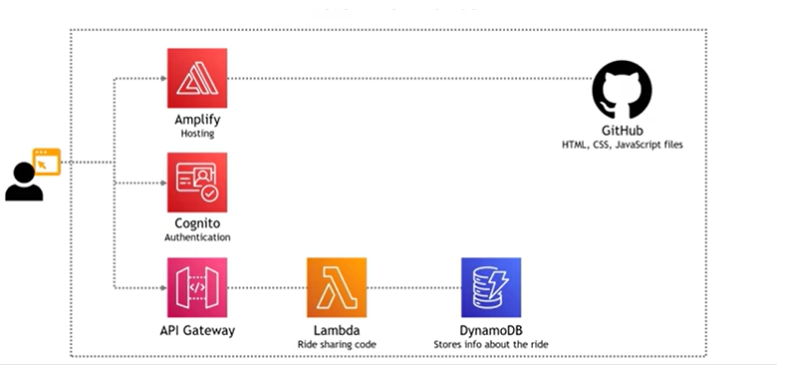

# Wild Rydes Serverless App

## Description
The Wild Rydes app is a serverless ride-sharing web application developed as a hands-on project to explore AWS services. This application allows users to register, log in, and request unicorn rides via an interactive map. It integrates multiple AWS services, including Amplify for hosting, Cognito for authentication, Lambda for backend logic, DynamoDB for database management, and API Gateway for API endpoints.
This project is based on the original Amazon workshop, with config and enhancements added during implementation.

## Documentation
For a detailed walkthrough of the project setup, architecture, and implementation, please take a look at the [Project Documentation (PDF)](WildRydes%20WebApp.pdf).

## Architecture of the Wild Rydes application – showcasing serverless integration with AWS services

## Features
- **User Authentication**: Secure user registration and login with Amazon Cognito.
- **Ride Requests**: Users can request unicorn rides by clicking on a map powered by ArcGIS.
- **Serverless Backend**: AWS Lambda processes ride requests and interacts with the database.
- **Database**: Amazon DynamoDB stores user data and ride details.
- **API Management**: Amazon API Gateway manages API endpoints and enforces secure access.
- **Continuous Deployment**: AWS Amplify handles hosting and CI/CD pipelines for seamless updates.

## Connect with me 

**Kanika Mathur**  
- [E-mail](mkanika.90@gmail.com)
- [GitHub](https://github.com/KanikaGenesis)  
- [LinkedIn](https://www.linkedin.com/in/kanika-mathur-083080121)  
